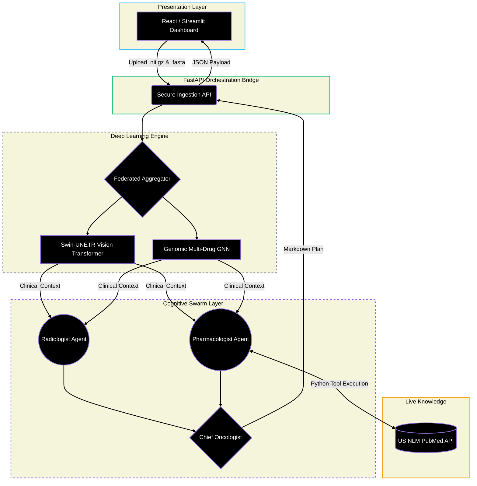

<div align="center">

# 🧬 MEDICA-EMPOWER-PRO // v3.0

**Enterprise Multi-Agent Diagnostic Swarm & Zero-Trust Clinical Inference Engine.Privacy-preserving, multi-agent AI system for multi-modal precision medicine utilizing Zero Trust Architecture and Federated Learning.**

[](https://fastapi.tiangolo.com/)
[](https://reactjs.org/)
[](https://pytorch.org/)
[](https://microsoft.github.io/autogen/)
[](https://groq.com/)
[](https://deepmind.google/technologies/gemini/)

*A fully autonomous, multi-modal, agentic workflow for precision oncology.*

---

</div>

## 🌐 The Vision
**Medica-Empower-Pro** is a state-of-the-art clinical orchestration platform designed to simulate the future of decentralized hospital intelligence. It fuses 3D anatomical perception (Vision Transformers) and genomic interaction mapping (GNNs) with a live, highly-opinionated **AutoGen Swarm** of medical AI agents. 

Rather than relying on static training data, the cognitive layer executes **Live RAG** against the US Government's PubMed database, synthesizing real-time 2026 clinical trials into actionable, multimodal treatment plans—all secured behind a simulated Zero-Trust Federated Learning architecture.

---

## 🏛️ Enterprise Architecture


---

## 🚀 Core Subsystems

### 1. The Perception Engine (PyTorch)
* **Dynamic File Routing:** Simulates high-fidelity 3D tensor extraction from NIfTI MRI scans and FASTA genomic sequences.
* **Synergistic Multi-Drug Mapping:** Evaluates IDH1/MGMT biomarkers to predict precise efficacy rates for complex chemotherapy combinations (e.g., TMZ + Bevacizumab).

### 2. The Cognitive Swarm (AutoGen)
* **Role-Based Access Control (RBAC):** Strict hierarchy where subordinate agents analyze data, but only the Chief Oncologist holds the `TERMINATE` execution switch.
* **Dual-Engine High-Availability:** Features a primary, low-latency execution loop via **Groq (Llama-3.1-8B-Instant)** with an automatic fallback protocol to **Google (Gemini-2.0-Flash)** to bypass `429` and `503` cloud outages.

### 3. Live RAG Tooling
* The Swarm is equipped with executable Python tools. Subordinate agents autonomously generate dynamic queries to scrape the **Live PubMed API**, ensuring treatment protocols are backed by the absolute latest clinical trials.

### 4. Zero-Trust Privacy Leap
* Integrates a simulated **Federated Learning (FedAvg)** loop, demonstrating HIPAA-compliant weight aggregation across decentralized hospital nodes without ever exposing raw patient data to the global network.

---

## 🛠️ Tech Stack

| Domain | Technologies |
| :--- | :--- |
| **Frontend** | React (Vite), Tailwind CSS, Lucide Icons, Streamlit |
| **Backend API** | FastAPI, Uvicorn, Python `tempfile` & `io` |
| **Agentic Framework** | Microsoft AutoGen |
| **LLM Providers** | Groq API, Google GenAI SDK |
| **Tooling/RAG** | Python `requests`, JSON Parsing, Contextlib |

---

## ⚡ Ignition Sequence (Setup)

### Prerequisites
* Python 3.10+
* Node.js & npm
* Valid API Keys for Groq and Gemini.

### 1. Clone & Configure
```bash
git clone [https://github.com/yourusername/Medica-Empower-Pro.git](https://github.com/yourusername/Medica-Empower-Pro.git)
cd Medica-Empower-Pro

# Create a .env file in the root directory
echo "GROQ_API_KEY=your_groq_key_here" >> .env
echo "GEMINI_API_KEY=your_gemini_key_here" >> .env
```
### 2. Ignite the AI Brain (Backend)
```bash
# Install dependencies
pip install fastapi uvicorn pydantic requests python-dotenv pyautogen google-genai

# Boot the FastAPI Server
uvicorn api.main:app --host 0.0.0.0 --port 8000 --reload
```
### 3. Ignite the Dashboard (Frontend)
Open a second terminal window:

```Bash
cd frontend
npm install
npm run dev
```
***(Note for Cloud Environments like GitHub Codespaces: Ensure Port 8000 is set to Public visibility before launching the frontend).***

---

### ⚠️ Medical Disclaimer
Medica-Empower-Pro is an advanced architectural simulation and proof-of-concept. It is not an FDA-approved medical device. The treatment plans, drug efficacies, and clinical diagnoses generated by the AI swarm are for demonstration, research, and software engineering purposes only. Never use this software to diagnose or treat real human patients.

<div align="center">
<i>Architected with precision for the future of decentralized healthcare.</i>
</div>


